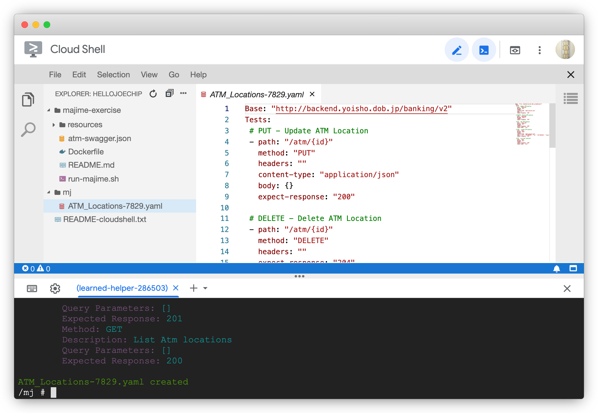

# majime – Hands-On Exercise

What does [majime](https://github.com/u1i/majime) do?

* majime runs test cases on API endpoints
* test cases are defined in YAML files
* majime can generate test cases from Swagger specs

## 1 – Start Google Cloud Shell

Free to use with any Google Account, no need to sign up or pay for Google Cloud:

[Google Cloud Shell](https://ssh.cloud.google.com/cloudshell/editor?hl=en_GB&fromcloudshell=true)

You should see a graphical text editor with directory navigation and a Linux Shell below.

## 2 – Run the majime Environment

We're using a Docker image that has everything in it for your convenience:

#### Clone this repository:

`git clone https://github.com/u1i/majime-exercise`

#### Change into the directory:

`cd majime-exercise`

#### Run the script that does all the rest:

`./run-majime.sh`

## 3 – Experiment with majime

#### Get info on the usage

`majime -h`

#### Generate Test Case from Swagger

`majime -g http://backend.yoisho.dob.jp/banking/v2/swagger`

You should see a new file in the directory (in the GUI Editor) named ATM_Locations-<RANDOM_NUMBER>.yaml – open it and have a look!

#### Run Test Case

`majime -f majime -f ATM_Locations-XXXX.yaml`

Some tests will fail – find a way to edit the YAML and experiment!